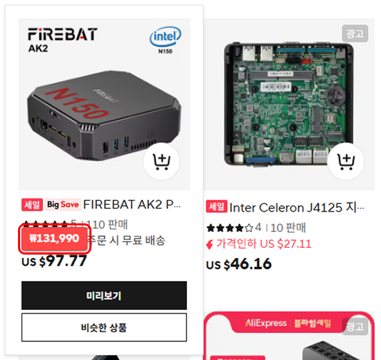
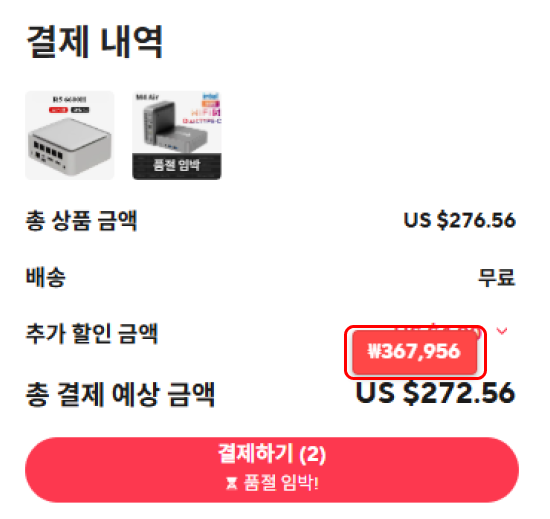

  <a href="README_kr.md">한국어</a> | 
  <a href="README.md">English</a>

---

This Chrome extension provides currency conversion between Korean Won and US Dollars on the AliExpress website.

## Distribution
[Korean Chrome WebStore](https://chromewebstore.google.com/detail/%EC%95%8C%EB%A6%AC%EC%9D%B5%EC%8A%A4%ED%94%84%EB%A0%88%EC%8A%A4-%EB%8B%AC%EB%9F%AC-%EC%9B%90%ED%99%94-%EB%B3%80%ED%99%98/ccdmpmjjdlmgaofeldpoocpdckekpina?hl=ko)

[English Chrome WebStore](https://chromewebstore.google.com/detail/ccdmpmjjdlmgaofeldpoocpdckekpina/preview?hl=en&authuser=0)

## Features

- Currency conversion between USD and KRW
- Automatic price conversion on AliExpress site
- Popup display with "Price" text when hovering over prices
- Multilingual support (Korean and English)

    
    

## Installation Guide

1. Download or clone this repository.
2. Navigate to `chrome://extensions/` in your Chrome browser.
3. Enable "Developer mode" in the top right corner.
4. Click the "Load unpacked extension" button.
5. Select the downloaded extension folder.

## How to Use

After installation, visit [AliExpress](https://ko.aliexpress.com) and hover over price elements. A "Price" popup will appear.

## Configuration Options

- Update exchange rate information
- Set automatic update frequency
- Configure text and background colors
- Adjust font size
- Preview area
- Language settings (Korean/English)

## Multilingual Support

This extension uses Chrome's i18n API for multilingual support. Currently supported languages:
- Korean (default)
- English

The language can be changed in the 'Language Settings' section at the top of the extension popup.

## About

This extension was created to make price comparisons easier when shopping on AliExpress.
The current version supports bidirectional conversion between dollars and Korean won, with plans to support various currencies in future updates.